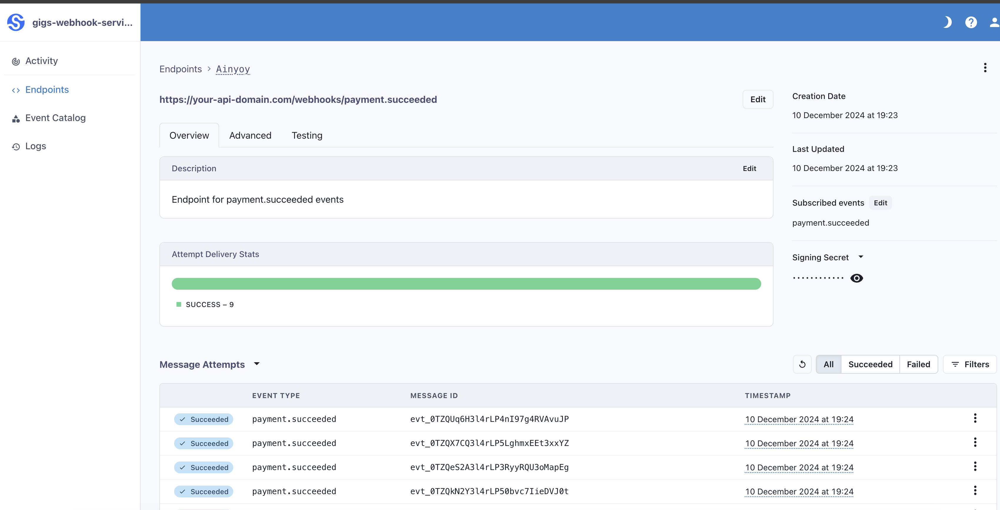

# SVIX Webhook Service

A Go-based webhook service that processes Google Pub/Sub messages and forwards them to Svix webhooks.


## Project Structure
```
go-challenge/
├── cmd/
│   └── webhook-service/
│       └── main.go          # Application entry point
├── internal/
│   ├── controllers/
│   │   ├── notification.go  # HTTP request handling
│   │   └── parser.go        # Request parsing logic
│   ├── logger/
│   │   └── logger.go        # Logging configuration
│   ├── models/
│   │   ├── event.go         # Event data structures
│   │   ├── pubsub.go        # Pub/Sub message structures
│   │   └── webhook.go       # Webhook event types
│   ├── router/
│   │   └── router.go        # HTTP routing setup
│   ├── svix/
│   │   ├── client.go        # Svix client implementation
│   │   ├── init.go          # Application initialization
│   │   └── retry.go         # Retry logic
│   ├── utils/
│   │   └── error.go         # Error handling utilities
│   ├── tasks/
│   │   └── webhook_task.go  # Webhook processing
│   └── worker/
│       └── pool.go          # Worker pool implementation
├── test/
│   ├── events/              # Test event JSON files
│   └── run.sh               # Test runner script
├── scripts/
│   └── delete-svix-apps.sh  # Cleanup utility
├── .air.toml                # Air configuration for hot reload
├── .env                     # Environment variables
├── .gitignore
├── .golangci.yml            # Linter configuration
├── go.mod                   # Go module definition
├── go.sum                   # Go module checksums
├── Makefile                 # Build and development commands
└── README.md                # Project documentation
```

### First Time Setup
```bash
# Install golangci-lint (required only once)
make install-lint
```

After installation, you can run the linter and other commands:

```bash
# Run linter
make lint

# Run tests
make test

# Run tests with gotestsum
make test-sum

# Build the service
make build

# Run the service
make dev
```

## Configuration

Set the following environment variables:
```
export SVIX_AUTH_TOKEN=your_svix_token
export PORT=8080
```
## API Endpoints

### POST /notifications

Receives Pub/Sub events and forwards them to Svix.

**Request Body:**
```
{
  "object": "event",
  "id": "evt_0TZRAuIV3l4rLP1NlZivWexSK93v",
  "data": {
    "data": "specific"
    "to": "webhook endpoint"
  },
  "datacontenttype": "application/json",
  "project": "dev",
  "source": "https://api.gigs.com",
  "specversion": "1.0",
  "time": "2023-03-24T15:50:41Z",
  "type": "subscription.updated",
  "version": "2023-01-30"
}
```
For more information about design decisions and future improvements, see [NOTES.md](NOTES.md).

## Code Formatting

The project uses multiple layers of code formatting:

### 1. VS Code Settings (Real-time/On Save)
- Formats as you code
- Handles individual files you're working on
- Configure in VS Code settings:
```json
{
    "editor.formatOnSave": true,
    "go.formatTool": "goimports",
    "[go]": {
        "editor.defaultFormatter": "golang.go",
        "editor.formatOnSave": true,
        "editor.codeActionsOnSave": {
            "source.organizeImports": "explicit"
        }
    },
    "go.lintTool": "golangci-lint",
    "go.lintFlags": ["--fast"],
    "go.useLanguageServer": true
}
```

### 2. Makefile Command (Manual/Bulk)
```
bash
make fmt
```

- Formats ALL files in the project
- Uses gofmt and goimports
- Useful for bulk formatting
- Good for CI/CD pipelines

### 3. Linter Verification (.golangci.yml)
- Verifies formatting with golangci-lint
- Reports formatting violations
- Run with:
```
bash
make lint
```
## Svix Cleanup Script

This utility script helps you clean up all Svix applications in your environment.
1. Install the [Svix CLI] 
```
brew install svix/svix/svix
```
2. Make sure you have your Svix authentication token ready


### Usage

1. Make the script executable (first time only):
   ```bash
   chmod +x scripts/delete-svix-apps.sh
   ```

2. Run the script:
   ```bash
   SVIX_AUTH_TOKEN=${SVIX_AUTH_TOKEN} ./scripts/delete-svix-apps.sh
   ```

### What it does

- Lists all Svix applications in your account
- Automatically deletes each application (no confirmation required)
- Provides feedback on the deletion process

## Local Test Runner Script

This utility script helps test the webhook service by sending sample Pub/Sub messages to your local environment.

### Prerequisites

1. Make sure the webhook service is running locally
2. The service should be listening on port 8080 (default)

### Usage

1. Make the script executable (first time only):
   ```bash
   chmod +x test/run.sh
   ```

2. Run the script:
   ```bash
   ./test/run.sh http://localhost:8080/notifications
   ```


### What it does

- Sends sample Pub/Sub messages to your webhook endpoint
- Each message simulates different event types
- Useful for local development and testing

### Happy Path demo




If we try to run the script again (remove the "--fail" arg):


